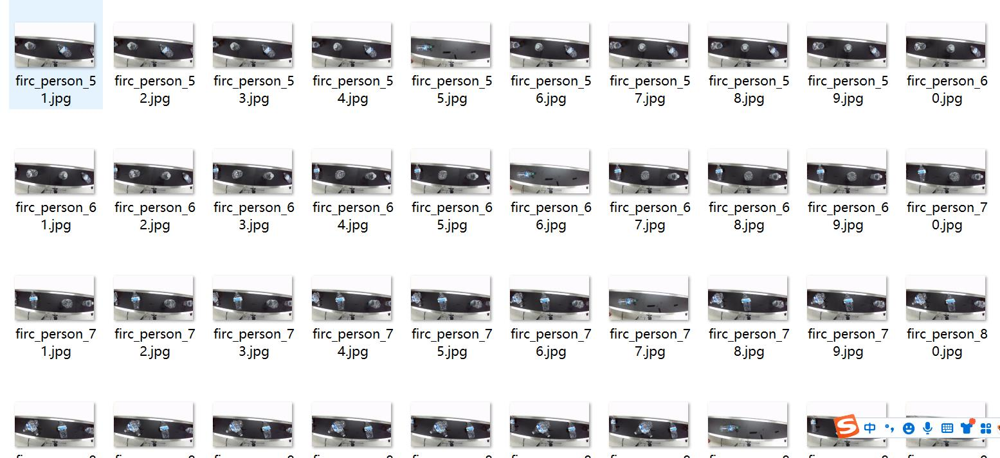
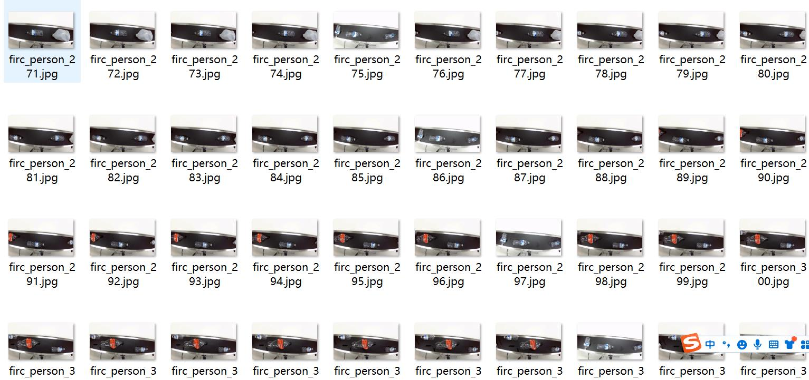
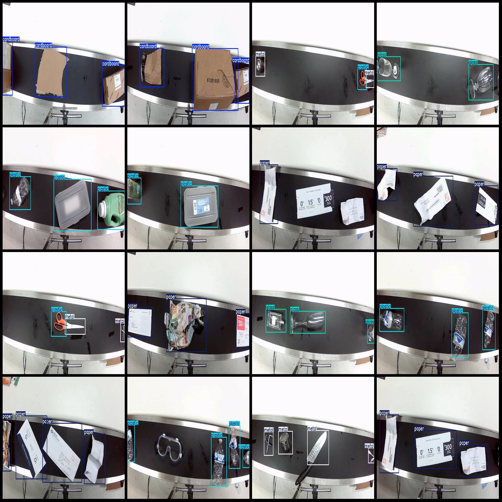
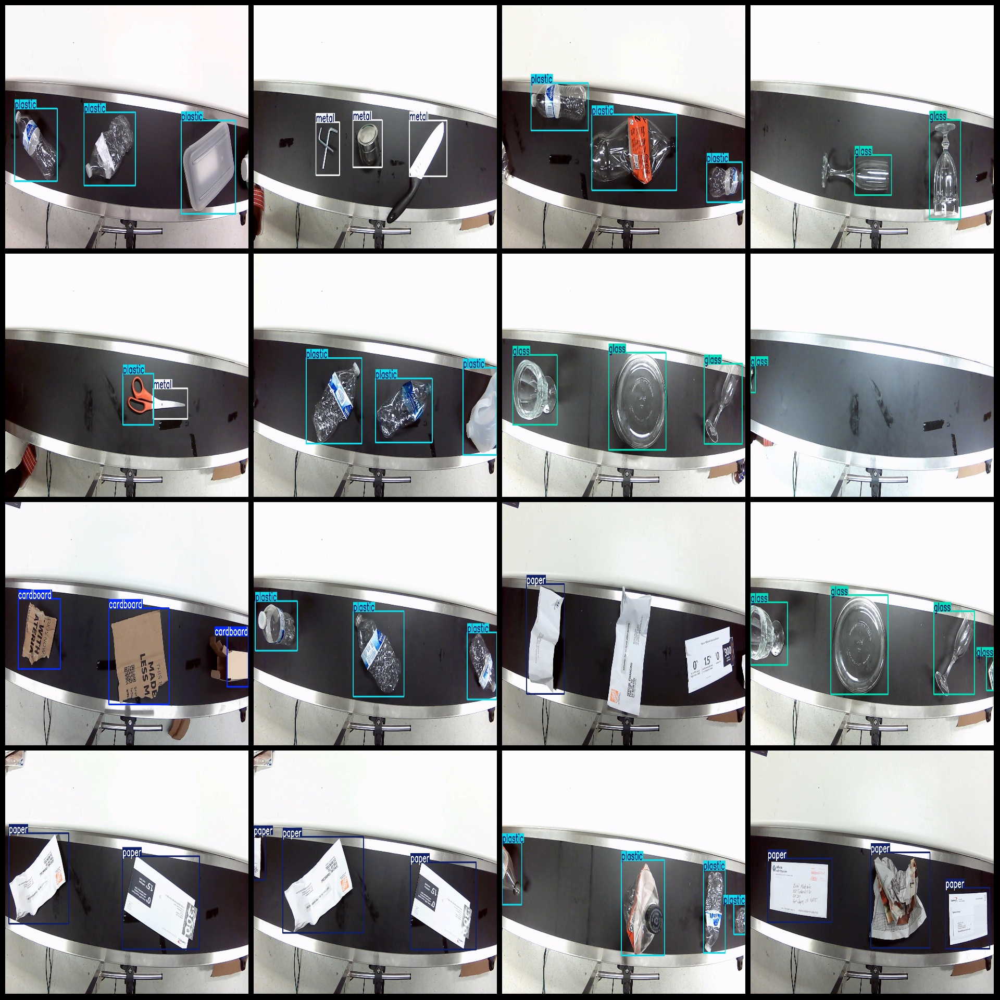

# Waste conveyor belt garbage identification dataset in VOC+YOLO format with 1476 images and 5 categories

Dataset format: Pascal VOC format + YOLO format (without split paths in the txt file, only containing jpg images along with corresponding VOC format xml files and yolo format txt files)
Number of images (jpg file count): 1476
Number of annotations (xml file count): 1476
Number of annotations (txt file count): 1476
Number of annotation categories: 5
Annotation category names (note that the order of categories in the yolo format is not consistent with this, but refer to the labels folder's classes.txt for accuracy): ["cardboard", "glass", "metal", "paper", "plastic"]
Number of bounding boxes for each category:
- cardboard (Paper) bounding box count = 798
- glass (Glass) bounding box count = 584
- metal (Metal) bounding box count = 635
- paper (Paper) bounding box count = 794
- plastic (Plastic) bounding box count = 1594
Total bounding box count: 4405
Image resolution: 1920x1080
Annotation tool used: labelImg
Annotation rules: Draw rectangles around the categories
Important note: No guarantees are made regarding the accuracy of the trained models or weight files.
Special declaration: This dataset does not provide any assurances regarding the accuracy of the trained models or weight files.
Image preview:

## Images

Here is a pay link on Stripe ( https://buy.stripe.com/3cs8yP7sY87d0vu9AB ). Please contact me lonlonago@foxmail.com after funding $89, and I will send you a complete data files , thank you!

